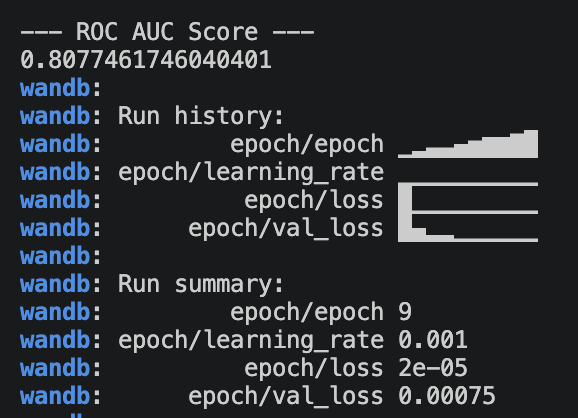

# 🛡️ AI-Powered Intrusion Detection System (IDS)


A Proof of Concept (PoC) for a Network Intrusion Detection System using an unsupervised Deep Learning approach. This project was developed as a complementary study during an immersion internship at **Algérie Télécom**, exploring proactive security measures for modern telecommunication infrastructures (like FTTH networks).

## 🧠 How it Works

Unlike traditional signature-based detection, this system uses an **Autoencoder** built with **PyTorch**. 
1. The model is trained exclusively on **Normal (Benign)** network traffic.
2. It learns to compress (encode) and reconstruct (decode) the 78 network features.
3. When fed with new traffic, a high **Mean Squared Error (MSE)** indicates an anomaly (Zero-Day Attack).

## 🚀 Features

* **Unsupervised Learning:** Capable of detecting unknown (Zero-Day) attacks without needing labeled attack data during training.
* **Real-time API:** A fast and lightweight backend powered by FastAPI.
* **Interactive Dashboard:** A modern UI built with React and Tailwind CSS to simulate and monitor network traffic.
* **Fully Containerized:** Easy to deploy and run anywhere using Docker.

## 📊 Model Performance

The training process and metrics were tracked using **Weights & Biases (W&B)**. The model converged quickly and achieved a **ROC AUC Score of ~0.80** on the test dataset.


> *Training loss curve showing the rapid convergence of the Autoencoder.*

## 🛠️ Tech Stack

* **Machine Learning:** PyTorch, Scikit-learn, Pandas, W&B
* **Backend:** FastAPI, Uvicorn, Python 3.10
* **Frontend:** React, Vite, TailwindCSS, Framer Motion
* **DevOps:** Docker, Docker Compose

## 🐳 Getting Started

You can run the entire system (Frontend + Backend) with a single command using Docker.

### Prerequisites
* [Docker](https://www.docker.com/) and Docker Compose installed on your machine.

### Installation & Run

1. Clone the repository:
   ```bash
   git clone [https://github.com/your-username/ai-powered-ids.git](https://github.com/your-username/ai-powered-ids.git)
   cd ai-powered-ids
